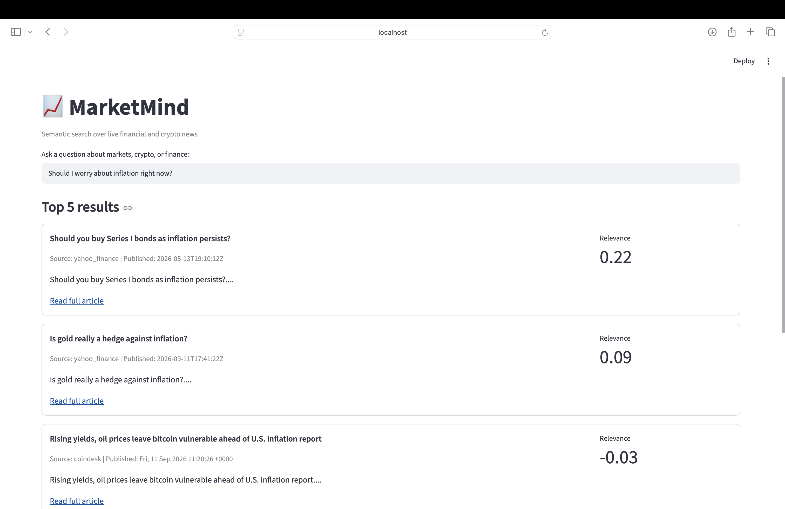
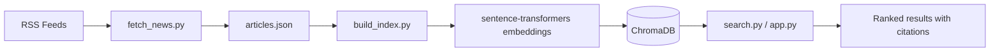

# MarketMind

A RAG (Retrieval-Augmented Generation) system for semantic search over live financial and crypto news — built entirely with free, local tools (no paid APIs).

## Demo



## Architecture



## Stack
- **Ingestion**: RSS feeds (Yahoo Finance, CoinDesk, MarketWatch)
- **Embeddings**: sentence-transformers (all-MiniLM-L6-v2), runs locally
- **Vector store**: ChromaDB (local, persistent)
- **Search**: hybrid search (vector + BM25) with cross-encoder reranking (ms-marco-MiniLM-L-6-v2) for final precision
- **Interface**: Streamlit

## Running it
```
pip install -r requirements.txt
python3 fetch_news.py
python3 build_index.py
streamlit run app.py
```